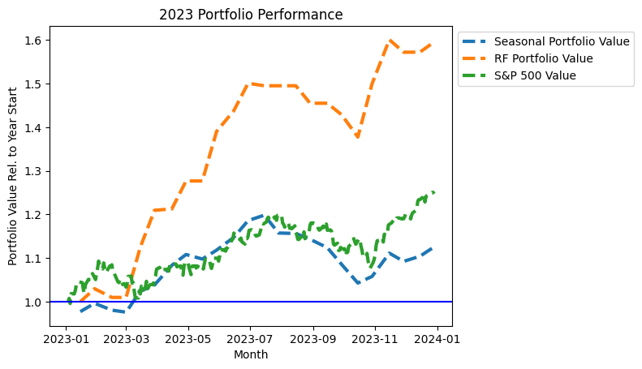

# Economist/Data Scientist

[Resume (PDF)](Ray_Wang_2024.pdf)

### Technical Skills
- **R**: ggplot, data.table, Shiny
- **Python**: pandas, scipy, scikit-learn, numba, conda
- Dynamic discrete choice models, structural demand estimation, causal inference
- Machine learning (random forest), classification and regression models (linear, logistic), exploratory data analysis, data visualization
- Java, Stata, PHP
- Git, AWS, SQL

## Projects
### [Exploration of Seasonal Trading](https://github.com/raywang202/technical-trading)

An analysis of seasonal trading strategies in the S&P 500, using Jupyter Notebooks. Using a dataset of over 6 million daily close prices across the S&P 500, I use a random forest classifier to identify a subset of very profitable trades among all seasonal price signals, trading off recall for improved precision. The random forest strategy resulted in simulated returns that outperformed both the S&P 500 and seasonal trading strategies in both 2022 and 2023

### [Dissertation Code](https://github.com/raywang202/dissertation)

Code used to implement my dissertation, [The Impact of Grades on College Major Choice, Dropout, and Labor Outcomes](https://cdr.lib.unc.edu/concern/dissertations/5m60qz54r?locale=en). At the core of my model is solving via backwards induction a dynamic programming model of student behaviors throughout college and into the workforce (using the framework of Keane and Wolpin 1997). This involves maximizing a simulated likelihood over a set of dozens of parameters, which requires calculating utilities over a large state space. Solving this problem would have been computationally infeasible without both the use of Python's Numba package as well as the University's computing cluster.

## Work Experience
### Center for Naval Analyses (CNA), Arlington, VA | Jun 2020 - Present

**_Research Scientist / Economist_ | Nov 2023 - Present**  
-	Led technical effort to predict Navy sailor re-enlistment decisions using 7 million+ panel observations, using conditional choice probability (CCP) estimation methods in R
-	Simulated counterfactual policy impacts on sailor retention across different subpopulations. Visualized and presented results to Navy leadership, affecting implementation of promotion and compensation policies in Navy’s Detailing Marketplace Assignment Policy (DMAP)
-	Mentored junior team members in econometric methods and programming best practices

**_CNA Field Representative to Carrier Strike Group (CSG) 12_ | Oct 2022 – Nov 2023**
- Directly supported Commander, CSG-12 with analysis on operational capabilities of first-in-class aircraft carrier. Embarked on board USS Gerald R. Ford for Oct - Nov 2022 and May - Nov 2023 deployments
- Worked independently in a fast turnaround and technology-constrained environment. Regularly briefed Admiral on findings, and designed research plan to address emerging priorities timelines
- Collected and analyzed quantitative and qualitative data, and provided tailored recommendations to both senior leadership and tactical-level action officers
- Statistically modeled the impact of new military technology on Composite Training Unit Exercise certification metrics. This analysis identified focus areas for system improvements, which were implemented prior to May 2023 deployment and contributed to significant increase in aircraft carrier operational uptime compared to Oct 2022 deployment
- Designed and executed field experiment to assess the impacts of new ship’s systems on pre-existing electronic warfare tactics, and to identify possible mitigations and best practices 

**_Research Analyst / Economist_ | Jun 2020 - Oct 2022**
- Took on project technical lead role within one year of on-boarding as junior researcher. Quickly learned legacy Navy sailor retention model, extended model to simulate heterogeneous policy impacts across different subpopulations, and documented model framework leading to successful hand-off of model after project completion
- Led project that adapted Navy-specific econometric model and codebase to differently structured datasets and use-cases for the Marine Corps. Successfully completed project on a shortened timeline
- Developed metric to predict military recruiting yield across different geographic regions using LASSO methods. Presented results to non-technical audience of practitioners
- Translated legacy data cleaning methods from Stata to Python, integrating them into an automated data processing pipeline for increased efficiency and scalability

### DC Energy, Vienna, VA | Sep 2012 - Oct 2013
**_Analyst_ | Sep 2012 - Oct 2013**
- Analyzed electricity and steel/iron ore markets using R and MySQL. Proposed trading strategies to management that led to 20% returns over 6 months
- Developed dashboards with PHP and R Shiny to visualize asset prices in support of daily trading

## Education
### PhD in Economics
**_University of North Carolina at Chapel Hill | 2014 - 2020_**
- Subfields: Structural applied microeconomics, labor economics, economics of education
- Dissertation involved data cleaning, dynamic programming, and program execution time optimization in Python using numba; data visualization in R
  - Code snippets available [here](https://github.com/raywang202/dissertation)
  - Dissertation available at the [UNC Library](https://cdr.lib.unc.edu/concern/dissertations/5m60qz54r?locale=en)

### BS Eng. in Operations Research and Financial Engineering
**_Princeton University | 2008 - 2012_**

## Other
- Top Secret security clearance (Nov 2022 – Present)
- Secret security clearance (Jan 2021 – Nov 2022)
- Fluent in English and Chinese, intermediate Spanish

